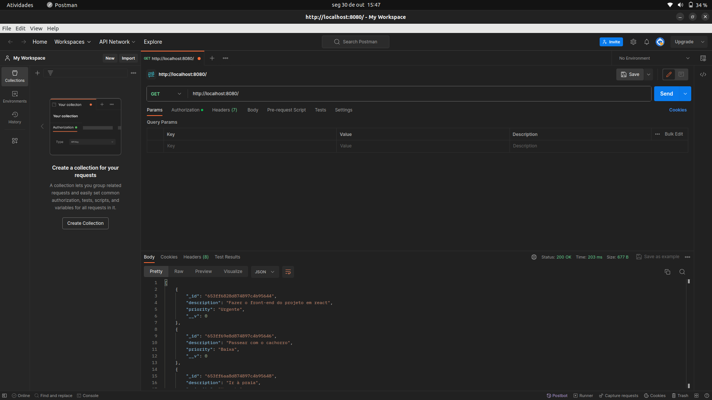
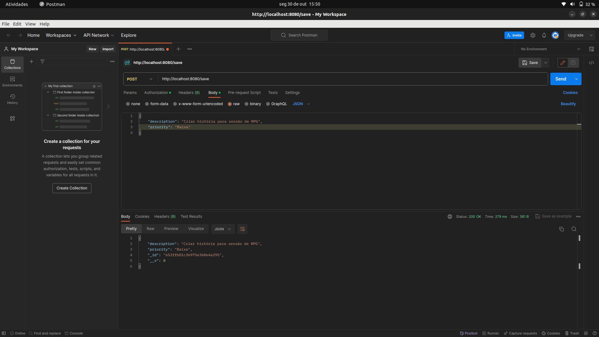
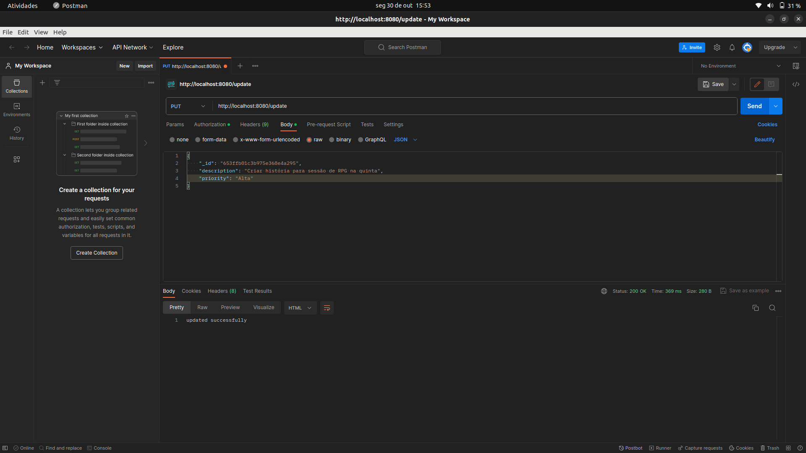
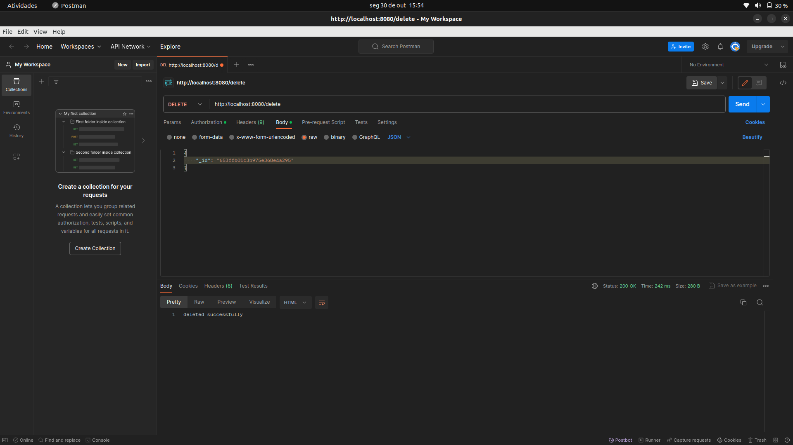

## TODO list API

Esta é uma API RESTful para gerenciar uma lista de tarefas, onde cada tarefa possui uma descrição e uma prioridade. A API é construída usando Node.js, Express e MongoDB.

## Pré-requisitos

Certifique-se de ter as seguintes ferramentas e tecnologias instaladas em seu ambiente de desenvolvimento:

- [Node.js](https://nodejs.org/)
- [MongoDB](https://www.mongodb.com/)
- [npm](https://www.npmjs.com/) (Normalmente é instalado com o Node.js)
- Um cliente MongoDB, como [MongoDB Compass](https://www.mongodb.com/try/download/compass) (opcional, mas útil para visualizar os dados).

## Configuração

1. Clone este repositório em sua máquina local:

   ```bash
   git clone https://github.com/FellipeMiguel/node-rest-todo-app.git
   ```

2. Navegue até o diretório do projeto

   ```bash
   cd node-rest-todo-app
   ```

3. Crie um arquivo .env na raiz do projeto com as seguintes variáveis de ambiente:

   ```makefile
   MONGODB_URL: seu-url-do-mongodb
   ```

   Substitua seu-url-do-mongodb pela URL de conexão do seu banco de dados MongoDB.

4. Inicie a aplicação
   ```bash
   npm run dev
   ```
   A API estará acessível em http://localhost:8080.

## Testando a API com o Postman

Você pode usar o [Postman](https://www.postman.com/) para testar os endpoints da API e verificar o funcionamento correto. Siga as etapas abaixo para configurar e realizar solicitações à API:

1. Faça o download e instale o Postman, se ainda não o tiver instalado.

2. Abra o Postman e crie uma nova coleção de solicitações para a API.

3. Crie solicitações individuais para os principais endpoints da API, como GET, POST, PUT e DELETE. Certifique-se de incluir os detalhes necessários, como URL e corpo da solicitação (para POST e PUT).

## Ilustração do postman

1. Utilizando o GET

- 

2. Utilizando o POST

- 

3. Utilizando o PUT

- 

4. Utilizando o DELETE

- 
